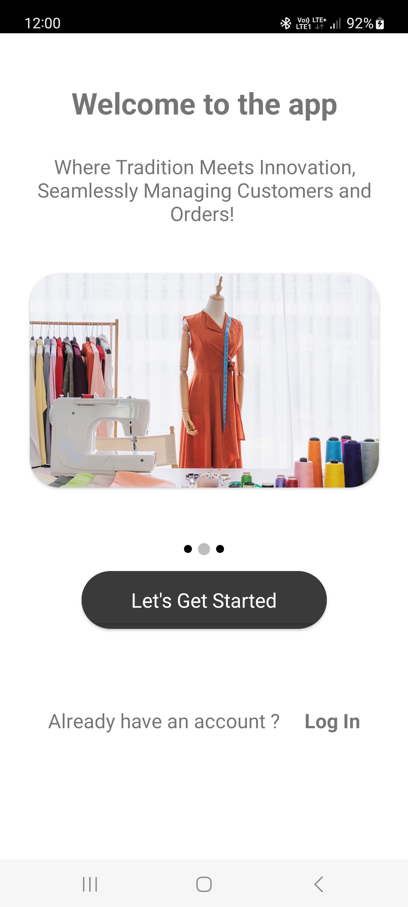
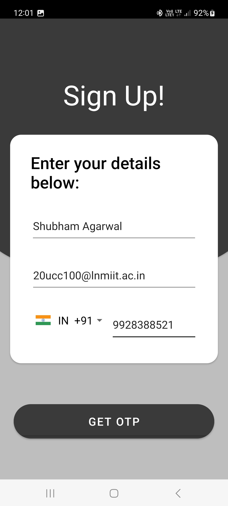
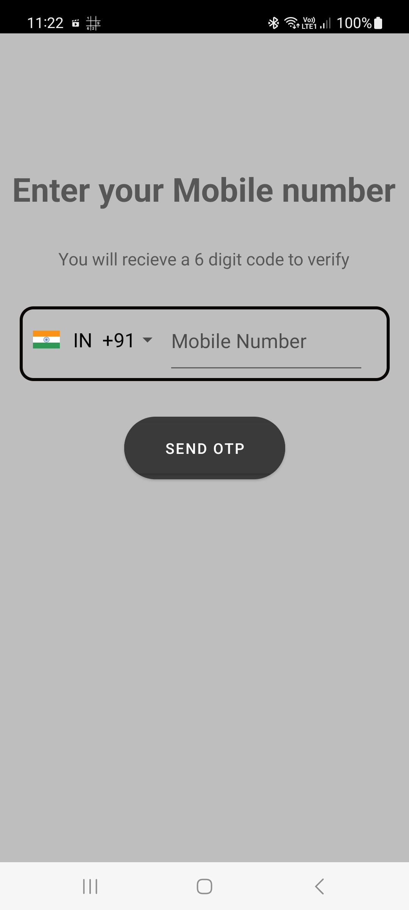
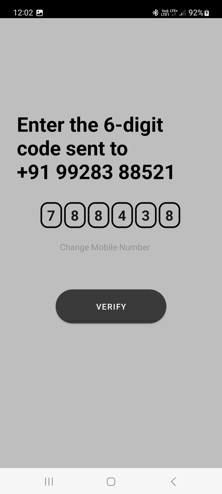

# TailorMade
TailorMade is a comprehensive and user-friendly mobile application designed specifically for tailors to manage customers and orders efficiently. This
innovative app combines the traditional art of tailoring and the convenience of modern technology, empowering tailors to streamline their workflow and
enhance their customer service.

With TailorMade, tailors can effortlessly keep track of their customers and their measurements, ensuring accurate and personalized fittings every
time. The app provides a user-friendly interface where tailors can quickly enter customer details, including measurements, preferences, and style
choices.

The app allows tailors to create, update, and track orders seamlessly. Tailors can assign unique order numbers, specify delivery dates, record
payment details, and attach reference images for each order.

# Screenshots

1. SignUp & LogIn Activity

    
    
    
    

    

2. 

